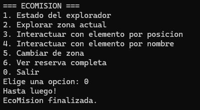

Proyecto final del curso de **Programación Orientada a Objetos**  
Pontificia Universidad Javeriana – Cali

---

## 👨‍💻 Integrantes

- **Mateo Rivera**
- **Diego Alejandro Calvo**

---

## 📖 Descripción del proyecto

**EcoMisión** es un juego de exploración ambiental hecho en **C++**, jugable por consola, donde el jugador controla a un explorador que recorre una reserva natural dividida en varias zonas (vivero, río y bosque húmedo).

El explorador empieza con **100 puntos de energía** y un **puntaje ambiental en 0**. La misión es restaurar el entorno haciendo lo siguiente:

- 🐾 **Rescatar animales heridos** → suma puntaje ambiental  
- 🌱 **Recolectar plantas medicinales** → recupera energía  
- 🗑️ **Limpiar residuos contaminantes** → suma puntaje pero gasta energía  
- 🌍 **Cambiar de zona** para encontrar más elementos por restaurar

El proyecto aplica los conceptos vistos en clase: **herencia**, **polimorfismo**, **clases abstractas** y **encapsulamiento**. Todo el flujo del juego lo controla la clase `EcoMision`, y los elementos del entorno (animales, plantas, residuos) heredan de la clase abstracta `ElementoInteractivo`.

---

## 📁 Estructura del repositorio

```
EcoMision/
├── docs/
│   ├── diseno.md          # Diagramas UML (inicial, ajustado y final)
│   └── bitacora-ia.md     # Bitácora del uso de IA generativa
├── src/
│   ├── CodeBlocks/        # Archivos del IDE Code::Blocks
│   ├── model/             # Todas las clases del juego
│   │   ├── EcoMision.cpp / .h
│   │   ├── Explorador.cpp / .h
│   │   ├── Reserva.cpp / .h
│   │   ├── Zona.cpp / .h
│   │   ├── ElementoInteractivo.cpp / .h
│   │   ├── AnimalHerido.cpp / .h
│   │   ├── PlantaMedicinal.cpp / .h
│   │   └── ResiduoContaminante.cpp / .h
│   └── main.cpp           # Punto de entrada del programa
└── README.md
```

> 💡 **¿Por qué los archivos están separados así?**  
> Organizamos el código en carpetas para mantenerlo limpio y entendible:  
> - `main.cpp` queda en `src/` porque es el punto de entrada del programa.  
> - Todas las clases viven en `src/model/` porque representan el modelo del juego.  
> - Los archivos de Code::Blocks van en `src/CodeBlocks/` para no mezclarlos con el código fuente.

---

## ⚙️ Cómo compilar y ejecutar

Como en el repositorio los archivos están separados en distintas carpetas, lo más sencillo es crear un nuevo proyecto en Code::Blocks y agregar todos los archivos juntos. Te dejo el paso a paso:

### Pasos

1. **Descargar el proyecto** desde GitHub (clic en el botón verde `Code > Download ZIP`) y descomprimirlo.

2. **Crear una carpeta nueva** en tu PC, por ejemplo `EcoMision/`.

3. **Copiar todos los archivos `.cpp` y `.h`** dentro de esa carpeta:
   - `main.cpp` (que viene en `/src`)  
   - Todos los archivos de `/src/model/` (las clases)

4. **Abrir Code::Blocks** y crear un nuevo proyecto:
   - `File > New > Project... > Console application > C++`  
   - Ponle el nombre `EcoMision` y guárdalo en la carpeta donde copiaste los archivos.

5. **Agregar los archivos al proyecto:**
   - Clic derecho sobre el proyecto en el panel izquierdo  
   - `Add files...` y selecciona todos los `.cpp` y `.h`

6. **Compilar y ejecutar:**
   - Presiona `F9` (Build and Run)  
   - O en el menú: `Build > Build and Run`

Y listo, debería abrirse la consola con el menú del juego 🎮

---

## 🎮 Cómo se juega

El juego corre en la consola (CMD) y es completamente interactivo. Te muestro cada apartado del juego con su explicación:

### 🟢 Menú principal


Este es el menú que aparece apenas inicia el juego. Aquí eliges qué hacer en cada turno escribiendo el número de la opción.

---

### 1️⃣ Estado del explorador


Muestra los datos actuales del explorador: nombre, energía restante, puntaje ambiental, cuántos elementos ha recolectado y en qué zona se encuentra. En el ejemplo el explorador se llama **Westcol** y está en el **Bosque Húmedo** con energía completa.

---

### 2️⃣ Explorar zona actual


Lista todos los elementos disponibles en la zona donde está parado el explorador. En este caso el bosque húmedo tiene un **Animal Herido** y una **Planta Medicinal** con los que se puede interactuar.

---

### 3️⃣ Interactuar con elemento por posición


Permite interactuar con un elemento escribiendo su número en la lista. Aquí elegimos el **0** (Animal Herido) y al ayudarlo ganamos **+10 puntos ambientales**.

---

### 4️⃣ Interactuar con elemento por nombre


Hace lo mismo que la opción anterior, pero ahora escribiendo el nombre del elemento en vez del número. Útil cuando no recuerdas la posición exacta.

---

### 5️⃣ Cambiar de zona


Muestra los códigos de las zonas disponibles en la reserva (`vivero`, `rio`, `bosque`) y permite moverse a la que escribas. En el ejemplo nos cambiamos al **rio**.


---
### 6️⃣ Ver reserva completa


Muestra el listado completo de todas las zonas que existen en la reserva con su respectivo código. Es útil para saber a dónde te puedes mover antes de usar la opción de cambiar de zona. En el ejemplo aparecen los tres códigos disponibles: `vivero`, `rio` y `bosque`.

---

### 0️⃣ Salir



Termina la partida y muestra un mensaje de despedida. Con esto el programa cierra.

---

## 🧩 Archivos principales del proyecto

| Archivo | ¿Qué hace? |
|---------|-----------|
| `main.cpp` | Crea la instancia de `EcoMision` y arranca el juego con `iniciarSistema()`. |
| `EcoMision.cpp/.h` | Clase principal. Controla el menú interactivo y todo el flujo del juego. |
| `Explorador.cpp/.h` | Representa al jugador. Maneja su energía, puntaje y zona actual. |
| `Reserva.cpp/.h` | Contiene todas las zonas usando un `unordered_map<string, Zona*>`. |
| `Zona.cpp/.h` | Cada zona del mapa. Guarda los elementos interactivos que tiene. |
| `ElementoInteractivo.cpp/.h` | Clase **abstracta** padre de todos los elementos del juego. |
| `AnimalHerido.cpp/.h` | Hereda de `ElementoInteractivo`. Da +10 al puntaje al rescatarlo. |
| `PlantaMedicinal.cpp/.h` | Hereda de `ElementoInteractivo`. Recupera energía del explorador. |
| `ResiduoContaminante.cpp/.h` | Hereda de `ElementoInteractivo`. Da puntaje pero gasta energía al limpiarlo. |

---

## 🛠️ Tecnologías y conceptos usados

- **Lenguaje:** C++
- **IDE:** Code::Blocks  
- **Estructura de datos:** `unordered_map`, `vector`
- **Conceptos POO aplicados:**
  - Herencia (clase `ElementoInteractivo` y sus hijos)
  - Polimorfismo (método `interactuar()` redefinido en cada subclase)
  - Clases abstractas
  - Encapsulamiento
