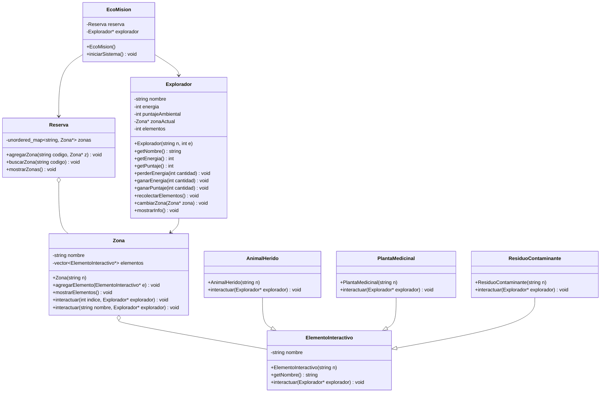

# EcoMisión — Evolución del Diagrama UML y Matriz de Decisiones

---

## Versión Inicial del UML

> Diagrama base con las clases principales y sus relaciones generales, antes de comenzar a programar.


### Descripción

En esta primera versión se planteó la idea general del proyecto.
Se definieron las clases principales: `EcoMision`, `Reserva`, `Zona`, `Explorador` y `ElementoInteractivo`.

También se agregó la herencia desde `ElementoInteractivo` hacia `PlantaMedicinal`, `AnimalHerido` y `ResiduoContaminante`, porque cada elemento debía tener una forma diferente de interactuar con el explorador.

---

## Versión Ajustada del UML

> Diagrama actualizado después de comenzar a programar, con los primeros ajustes que aparecieron al implementar las clases en C++.


### ¿Qué cambió?

* Se agregaron punteros como `Explorador*`, `Zona*` y `ElementoInteractivo*`, porque en C++ era más práctico trabajar con direcciones de memoria y no con copias completas de los objetos.

* En `Zona`, el atributo `elementos` pasó a ser un `vector<ElementoInteractivo*>`. Esto mejoró el diseño porque una zona no debía guardar un solo elemento, sino varios.

* Se agregaron constructores en varias clases para inicializar mejor los objetos desde el comienzo.

* Se agregó el destructor `~EcoMision()`, ya que al usar punteros es importante pensar en la liberación de memoria.

* Se mejoró la interacción en `Zona`, permitiendo interactuar por índice o por nombre. Esto hizo el sistema más flexible para el usuario.

---

## Versión Final del UML

> Diagrama final después de terminar el proyecto, con una estructura más limpia y más cercana al código entregado.



### ¿Qué cambió?

* Se dejó el diagrama más limpio y ordenado, quitando detalles que no eran tan necesarios para entender la estructura principal.

* Se mantuvo el uso de punteros, porque esa fue la forma usada en el código para conectar objetos como el explorador, las zonas y los elementos interactivos.

* Se mantuvo el `vector<ElementoInteractivo*>` en `Zona`, ya que fue clave para guardar varios elementos dentro de una misma zona.

* Se conservó la herencia desde `ElementoInteractivo` hacia las clases hijas, porque ahí se aplica el polimorfismo: cada elemento interactúa de una manera diferente.

* La versión final muestra mejor la idea del sistema: `EcoMision` controla el juego, `Reserva` administra las zonas, `Zona` contiene elementos, `Explorador` representa al jugador y los elementos interactivos modifican su energía o puntaje.

---

## Matriz de Decisiones

Pega esto **reemplazando** la parte donde tienes:

```md
## Matriz de Decisiones

> Pendiente por completar.
```

## Matriz de Decisiones

> Esta matriz resume las decisiones principales que se tomaron durante la evolución del UML y por qué esos cambios mejoraron el diseño del proyecto.

| Decisión                                         | Alternativas consideradas                                                   | Decisión final                                                                     | Justificación                                                                                                                                          | Riesgo si se modela mal                                                                                  |
| ------------------------------------------------ | --------------------------------------------------------------------------- | ---------------------------------------------------------------------------------- | ------------------------------------------------------------------------------------------------------------------------------------------------------ | -------------------------------------------------------------------------------------------------------- |
| Cómo representar las zonas                       | `vector`, `map`, `unordered_map`                                            | `unordered_map<string, Zona*>`                                                     | Se eligió porque la reserva busca zonas usando un código, por ejemplo `"bosque"` o `"rio"`. Así es más directo encontrar una zona por su nombre clave. | Se puede complicar la búsqueda de zonas o mezclar la lógica del mapa con la lógica del juego.            |
| Cómo guardar los elementos de una zona           | Un solo `ElementoInteractivo`, arreglo fijo, `vector`                       | `vector<ElementoInteractivo*>`                                                     | Una zona puede tener varios elementos, no solo uno. Con el `vector` se pueden agregar plantas, animales o residuos de forma dinámica.                  | La zona quedaría limitada a un solo elemento o sería difícil agregar nuevos objetos durante el juego.    |
| Cómo permitir distintos tipos de elementos       | Usar muchos `if/else`, clases separadas sin relación, herencia              | Crear una clase base `ElementoInteractivo`                                         | Se usó una clase base para que todos los elementos tengan una estructura común y puedan interactuar con el explorador.                                 | El código se volvería repetitivo y cada nuevo elemento obligaría a modificar muchas partes del programa. |
| Cómo hacer que cada elemento actúe diferente     | Un método general en `Zona`, condicionales por tipo, polimorfismo           | Método `interactuar()` en cada clase hija                                          | Cada elemento sabe qué debe hacer: la planta da energía, el animal da puntaje y el residuo quita energía. Esto hace el diseño más ordenado.            | La clase `Zona` terminaría haciendo demasiadas cosas y el código sería más difícil de mantener.          |
| Cómo conectar objetos en C++                     | Guardar objetos completos, referencias, punteros                            | Usar punteros como `Explorador*`, `Zona*` y `ElementoInteractivo*`                 | Los punteros permiten relacionar objetos sin copiarlos completos. Además ayudan a trabajar con herencia y polimorfismo.                                | Se podrían crear copias innecesarias o perder el comportamiento real de las clases hijas.                |
| Cómo representar la zona actual del explorador   | Guardar el nombre de la zona, guardar una copia de `Zona`, usar puntero     | `Zona* zonaActual`                                                                 | El explorador solo necesita saber en qué zona está. Con un puntero apunta directamente a la zona actual sin duplicarla.                                | El explorador podría quedar con una zona desactualizada o una copia que no refleja los cambios reales.   |
| Cómo interactuar con elementos                   | Solo por posición, solo por nombre, ambas opciones                          | `interactuar(int indice, Explorador*)` e `interactuar(string nombre, Explorador*)` | Se dejaron las dos formas porque dan más flexibilidad: el usuario puede elegir por número o por nombre del elemento.                                   | La interacción sería menos clara para el usuario o dependería de una sola forma de búsqueda.             |
| Cómo inicializar los objetos                     | Crear objetos vacíos y llenar datos después, usar constructores             | Agregar constructores en las clases principales                                    | Los constructores permiten crear los objetos con sus datos importantes desde el inicio, como nombre, energía o zona.                                   | Los objetos podrían quedar incompletos o con valores incorrectos al momento de usarlos.                  |
| Cómo manejar el explorador dentro de `EcoMision` | Objeto directo, variable global, puntero                                    | `Explorador* explorador`                                                           | Se usó puntero porque el explorador se crea dentro del sistema y se controla desde la clase principal del juego.                                       | Podría haber problemas de acceso, copias innecesarias o mala organización de la lógica principal.        |
| Cómo organizar la clase principal                | Poner todo en `main`, repartir lógica sin control, usar `EcoMision`         | `EcoMision` controla el flujo del sistema                                          | La clase `EcoMision` centraliza el inicio del juego, la creación de zonas, elementos y explorador. Así el `main` queda más limpio.                     | El programa quedaría desordenado y sería más difícil explicar qué parte controla el sistema.             |
| Cómo mostrar información del jugador             | Mostrar datos desde varias clases, acceder directo a atributos, usar método | `mostrarInfo()` en `Explorador`                                                    | El explorador es quien tiene su energía, puntaje y zona actual, por eso tiene sentido que él mismo muestre su información.                             | Se rompería el encapsulamiento o habría código repetido mostrando los mismos datos en varias partes.     |
| Cómo mejorar el diseño final                     | Mantener todo lo inicial, eliminar clases, ajustar detalles                 | Conservar clases principales y limpiar el UML                                      | La versión final mantiene lo importante: reserva, zonas, explorador y elementos interactivos, pero con una estructura más cercana al código real.      | El UML podría no coincidir con el programa y sería más difícil sustentarlo.                              |


---

