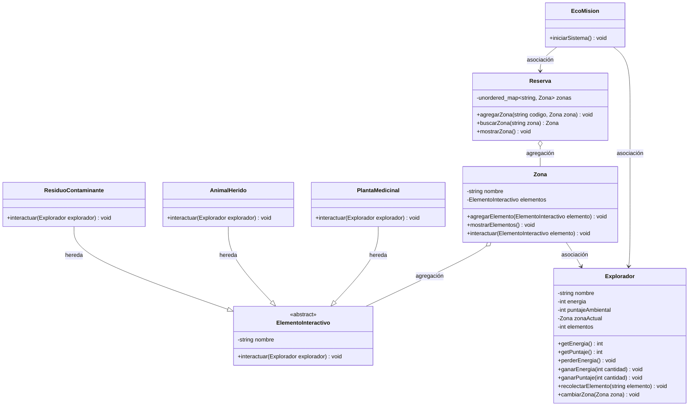
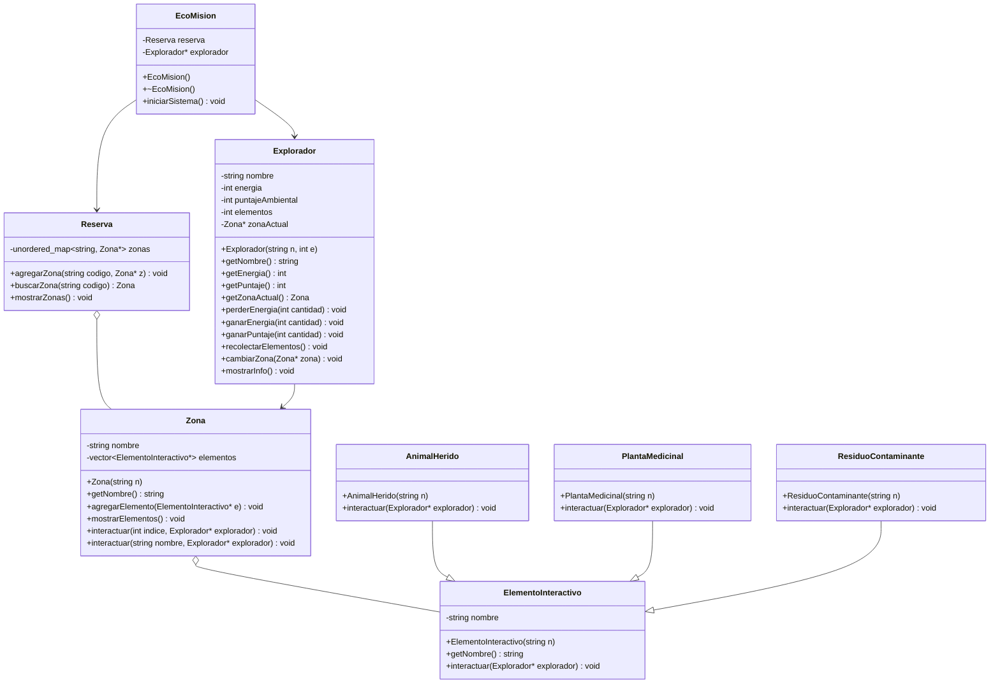

# EcoMisión — Evolución del Diagrama UML y Matriz de Decisiones

---

## Versión Inicial del UML

> Diagrama base con las clases principales y sus relaciones generales, antes de comenzar a programar.

### Descripción

En esta primera versión se planteó la idea general del proyecto.
Se definieron las clases principales: `EcoMision`, `Reserva`, `Zona`, `Explorador` y `ElementoInteractivo`.

También se agregó la herencia desde `ElementoInteractivo` hacia `PlantaMedicinal`, `AnimalHerido` y `ResiduoContaminante`, porque cada elemento debía tener una forma diferente de interactuar con el explorador.

---

## Versión Ajustada del UML

> Diagrama actualizado después de comenzar a programar, con los primeros ajustes que aparecieron al implementar las clases en C++.

### ¿Qué cambió?

* Se agregaron punteros como `Explorador*`, `Zona*` y `ElementoInteractivo*`, porque en C++ era más práctico trabajar con direcciones de memoria y no con copias completas de los objetos.

* En `Zona`, el atributo `elementos` pasó a ser un `vector<ElementoInteractivo*>`. Esto mejoró el diseño porque una zona no debía guardar un solo elemento, sino varios.

* Se agregaron constructores en varias clases para inicializar mejor los objetos desde el comienzo.

* Se agregó el destructor `~EcoMision()`, ya que al usar punteros es importante pensar en la liberación de memoria.

* Se mejoró la interacción en `Zona`, permitiendo interactuar por índice o por nombre. Esto hizo el sistema más flexible para el usuario.

---

## Versión Final del UML

> Diagrama final después de terminar el proyecto, con una estructura más limpia y más cercana al código entregado.

### ¿Qué cambió?

* Se dejó el diagrama más limpio y ordenado, quitando detalles que no eran tan necesarios para entender la estructura principal.

* Se mantuvo el uso de punteros, porque esa fue la forma usada en el código para conectar objetos como el explorador, las zonas y los elementos interactivos.

* Se mantuvo el `vector<ElementoInteractivo*>` en `Zona`, ya que fue clave para guardar varios elementos dentro de una misma zona.

* Se conservó la herencia desde `ElementoInteractivo` hacia las clases hijas, porque ahí se aplica el polimorfismo: cada elemento interactúa de una manera diferente.

* La versión final muestra mejor la idea del sistema: `EcoMision` controla el juego, `Reserva` administra las zonas, `Zona` contiene elementos, `Explorador` representa al jugador y los elementos interactivos modifican su energía o puntaje.

# Matriz de Decisiones de Diseño
## Proyecto: EcoMisión
## Integrantes: Diego Calvo y Mateo Orozco

| Decisión | Alternativas consideradas | Decisión final | Justificación | Riesgo si se modela mal |
|----------|--------------------------|----------------|---------------|------------------------|
| Cómo representar las zonas en la reserva | vector, arreglo estático, unordered_map | unordered_map<string, Zona*> | La reserva busca zonas por código como "bosque" o "rio", con unordered_map la búsqueda es directa e inmediata | Con arreglo o vector habría que recorrer todos los elementos para encontrar una zona por código |
| Cómo guardar los elementos dentro de una zona | arreglo estático, vector | vector<ElementoInteractivo*> | El vector crece automáticamente sin necesidad de definir un tamaño máximo, una zona puede tener diferente cantidad de elementos | Con arreglo estático se podría quedar sin espacio o desperdiciar memoria reservando más de lo necesario |
| Cómo manejar los diferentes tipos de elementos | Clases separadas sin relación, switch por tipo, herencia | Herencia desde ElementoInteractivo como clase abstracta | Las clases hijas comparten el método interactuar() cambiando solo el comportamiento, permite usar polimorfismo en Zona | Sin herencia habría código duplicado y no se podría recorrer los elementos con un solo for |
| Cómo activar un elemento dentro de la zona | Solo por índice, solo por nombre, las dos opciones | Sobrecarga de interactuar(): una versión por índice (int) y otra por nombre (string) | Permite dos formas naturales de acceso sin duplicar lógica interna, mejora la experiencia del usuario | Sin sobrecarga se necesitaría un solo método con lógica condicional más difícil de leer y mantener |
| Cómo representar la relación Explorador-Zona | El explorador guarda una copia de la zona, guarda un puntero, la zona guarda al explorador | Explorador tiene un Zona* (asociación) | El explorador visita zonas pero no las posee, la zona existe independientemente del explorador | Si el explorador guarda copia los cambios en la zona no se reflejan correctamente |
| Cómo separar los archivos del proyecto | Todo en un solo archivo, separar por clases | Cada clase en su propio .h y .cpp | Mejor organización, más fácil de mantener y depurar, cada archivo tiene una sola responsabilidad | Si todo está en un solo archivo el código se vuelve difícil de leer y mantener |
| Cómo manejar la búsqueda por nombre sin distinción de mayúsculas | Exigir escritura exacta, convertir a minúsculas antes de comparar | Usar std::transform con tolower antes de comparar | El usuario puede escribir el nombre en cualquier combinación de mayúsculas y minúsculas y el programa lo encuentra igual | Si se exige escritura exacta la experiencia del usuario es mala y el programa parece no funcionar |
| Cómo leer las opciones del menú | std::cin directo, std::getline con stoi | std::getline con stoi protegido con try-catch | Evita problemas con el buffer de entrada y no se cae si el usuario escribe algo inválido o presiona Enter vacío | Con cin directo quedan caracteres pendientes en el buffer que causan comportamiento inesperado en el menú |
| Cómo coordinar toda la experiencia del juego | Todo en main, dividir en funciones libres, clase coordinadora | Clase EcoMision con método iniciarSistema() | El main queda limpio con una sola llamada, cada responsabilidad tiene su clase y método | Si todo está en main se sobrecarga y no hay encapsulamiento ni organización |
| Orden de construcción de las clases | De afuera hacia adentro, aleatorio, de adentro hacia afuera | De adentro hacia afuera: Explorador, ElementoInteractivo, hijas, Zona, Reserva, EcoMision | Cada clase depende de las anteriores, este orden evita errores de compilación por referencias a clases no definidas | Si se construye en orden incorrecto el compilador no reconoce las clases y hay errores en cascada |
</table>

